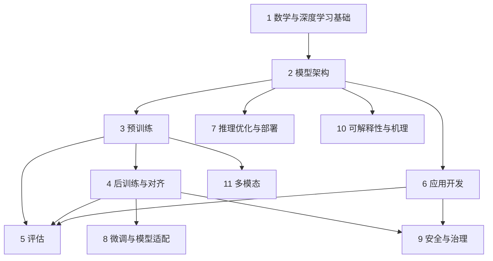

# 知识地图-大语言模型

- 领域：大语言模型（LLM）
- library：无
- 深度：L2
- 截至：2026-09
- 知识地图: 已读取
- 库内覆盖对照: 未执行（未指定 library）
- Confidence：模块清单较可靠（每个 L1 均有 ≥3 类外部来源支持）；L1 边界切法与承重判定含主观综合，`Confidence: Low`（见各模块「定义」中的边界说明）

> 标注说明：层级＝基础 / 核心 / 应用 / 前沿；主次＝承重 / 选学；稳定性＝稳定 / 快变。L1 的「承重」是相对整个领域而言；L2 的「承重」是相对其所属 L1 而言。证据类别编号见 `## 采证记录`。

## 领域定义与边界

**一句话定义**：大语言模型是以 Transformer 为主干、在海量文本上以「预测下一个 token」自监督预训练、再经后训练对齐的超大规模神经语言模型；本领域研究如何**构建、适配、评估、部署、应用与理解**它。

**范围内**：数学与深度学习基础、模型架构、预训练、后训练与对齐、评估、微调与适配、推理与部署、应用开发（提示 / RAG / Agent）、安全与治理、可解释性、多模态。

**明确不在范围内的相邻领域**：

- 传统 NLP 任务与语言结构分析：词性标注、句法分析、语义角色标注、指代消解等（SLP3 第三卷；ACL 的 Syntax and Parsing 等方向）
- 语音处理：语音识别、语音合成（SLP3 第 15~17 章；ACL 的 Speech Processing 方向）
- 机器翻译作为独立任务（SLP3 第 13 章）
- 通用机器学习与数据科学：GPU 数据分析、可视化等（NVIDIA NCA-GENL 考纲中的 Data Analysis and Visualization 部分）
- 强化学习的一般理论：只取后训练与推理 RL 所需的部分
- 垂直行业应用：医疗、金融等（见 `## 待验证候选`）

**重叠地带**：强化学习（后训练）、信息检索（RAG）、分布式系统与 GPU 编程（预训练 / 推理）、软件工程（应用开发）、计算机视觉（多模态）、AI 伦理与政策（安全与治理）。

## 模块总览

| # | L1 模块 | 一句话定义 | 层级 | 主次 | 稳定性 | 证据类别 | 知识地图命中 |
|---|---|---|---|---|---|---|---|
| 1 | 数学与深度学习基础 | 线代、微积分、概率与神经网络训练机制，是读懂后续一切模块的「语言」 | 基础 | 承重 | 稳定 | 4 类（①②③⑥） | — |
| 2 | 模型架构：从分词到Transformer | 文本如何变成 token 与向量，再经注意力堆叠成 GPT 式模型 | 核心 | 承重 | 稳定 | 5 类（②③④⑤⑥） | — |
| 3 | 预训练 | 用海量数据、算力与并行系统，让模型经下一词预测获得通用能力 | 核心 | 承重 | 稳定 | 4 类（②③④⑥） | — |
| 4 | 后训练与对齐 | 把「会续写」的基座模型变成听指令、合偏好、会推理的助手 | 核心 | 承重 | 快变 | 4 类（②③④⑥）＋⑦ | 激励相容 |
| 5 | 评估 | 衡量模型与系统「到底好不好」，并识别指标失真 | 核心 | 承重 | 快变 | 6 类（①②③④⑤⑥） | 吞吐量≠产出 |
| 6 | 应用开发：提示、RAG与Agent | 不改模型参数，靠上下文、检索与工具把模型组织成可用系统 | 应用 | 选学 | 快变 | 6 类（①②③④⑤⑥） | 信息完整度上限律、误差复利定律、角色即 Prompt |
| 7 | 推理优化与部署 | 让训练好的模型又快又省地生成与上线 | 应用 | 选学 | 快变 | 5 类（①②③⑤⑥） | 缓存 |
| 8 | 微调与模型适配 | 在已有模型上，用少量数据与算力定制下游任务 | 应用 | 选学 | 快变 | 5 类（①②③④⑥） | — |
| 9 | 安全与治理 | 攻击防御、可信性（偏见 / 幻觉）与合规治理 | 应用 | 选学 | 快变 | 5 类（①②③⑤⑥） | 指令扁平化缺陷 |
| 10 | 可解释性与机理 | 打开黑箱，理解模型内部如何表示与计算 | 前沿 | 选学 | 快变 | 3 类（②③⑤）＋⑦ | — |
| 11 | 多模态 | 把语言模型扩展到图像等其他模态并与世界对齐 | 前沿 | 选学 | 快变 | 3 类（②③⑤） | — |

**边界说明（主观综合处）**：

- **分词与嵌入并入「模型架构」**：SLP3 把它们分章讲，但 Raschka 第 2~4 章是一条连续流水线（文本→注意力→GPT），故合并为一个 L1。
- **「后训练与对齐」和「微调与模型适配」的区分**：两者都用到 SFT 技术。前者关注模型厂商把基座变成助手的**目标与算法**（RLHF / DPO / 推理 RL）；后者关注使用者对已有模型做**下游定制**（何时微调、PEFT）。
- **提示、RAG、Agent 合为一个 L1**：Databricks 考纲的 Application Development、mlabonne 的「LLM Engineer」、AI Engineering 第 5~6 章都把三者作为同一工程链路来讲。
- **「推理模型」不单列 L1**：它有 ②⑤⑦ 三类来源支持，但放入 L1-4 作为「前沿」L2，以免 L1 超过 12 个；它是当前变化最快的方向之一。

## 学习路径

**推荐顺序**：

1. **公共主干（承重）**：数学与深度学习基础（够用即止，不必学透再往前）→ 模型架构 → 预训练 → 后训练与对齐 → 评估
2. **按方向分叉**：
	- 工程向：应用开发 → 推理优化与部署 → 微调与模型适配 → 安全与治理
	- 研究向：预训练 / 后训练深入（Scaling Laws、推理 RL）→ 可解释性与机理 → 多模态
3. **前沿**：推理模型（L1-4 的 L2）、机理可解释性、架构变体，建议主干完成后再追。

## 知识清单

- [ ] **1 数学与深度学习基础**｜基础·承重·稳定｜证据 4 类（①②③⑥）
	- 定义：LLM 的一切机制都用线性代数、微积分与概率写成；神经网络训练机制是通用底座。
	- 先修：无（高中数学＋编程能力）
	- 入门关键词：矩阵乘法、梯度下降、链式法则、最大似然、交叉熵、反向传播、PyTorch autograd
	- 代表资料：[mlabonne/llm-course · LLM Fundamentals](https://github.com/mlabonne/llm-course)、[Stanford CS224N](https://web.stanford.edu/class/cs224n/)（第 2~4 讲）
	- [ ] 线性代数｜基础·承重·稳定｜嵌入、注意力本质上都是矩阵运算
	- [ ] 微积分与优化｜基础·承重·稳定｜梯度、链式法则与 SGD / Adam 等优化器
	- [ ] 概率统计与信息论｜基础·承重·稳定｜语言模型的训练目标（交叉熵）与评价指标（困惑度）都用它表达
	- [ ] 神经网络与反向传播｜基础·承重·稳定｜多层网络如何前向计算、反向求梯度（SLP3 第 6 章、CS224N 第 3 讲）
	- [ ] 深度学习框架与编程｜基础·承重·稳定｜Python 与 PyTorch 的张量、自动求导与训练循环（Raschka 附录 A、CS336 第 2 讲）
	- [ ] 序列模型前史（RNN / LSTM）｜基础·选学·稳定｜理解 Transformer 解决了什么问题（SLP3 第 14 章、CS224N 第 4 讲）

- [ ] **2 模型架构：从分词到Transformer**｜核心·承重·稳定｜证据 5 类（②③④⑤⑥）
	- 定义：文本→token→向量→多层注意力与前馈网络→下一个 token 的概率分布。
	- 先修：1 数学与深度学习基础
	- 入门关键词：next-token prediction、BPE、词嵌入、RoPE、自注意力、因果掩码、多头注意力、残差与 LayerNorm、Decoder-only、MoE
	- 代表资料：[rasbt/LLMs-from-scratch](https://github.com/rasbt/LLMs-from-scratch)（第 2~4 章）、[SLP3](https://web.stanford.edu/~jurafsky/slp3/)（第 2、3、5、7 章）、[Hands-On LLMs](https://github.com/HandsOnLLM/Hands-On-Large-Language-Models)（第 2~3 章）
	- [ ] 语言模型任务定义｜基础·承重·稳定｜从 n-gram 到神经网络，语言模型就是估计「下一个词」的概率（SLP3 第 3 章）
	- [ ] 分词｜核心·承重·稳定｜BPE 等子词算法决定模型「看到」的基本单位（SLP3 第 2 章、CS336 第 1 讲）
	- [ ] 嵌入与位置编码｜核心·承重·稳定｜把 token 与位置映射为向量（SLP3 第 5 章）
	- [ ] 注意力机制｜核心·承重·稳定｜自注意力、因果掩码、多头注意力（Raschka 第 3 章）
	- [ ] Transformer 块与 GPT 架构｜核心·承重·稳定｜残差、归一化、前馈层堆叠成 Decoder-only 模型（Raschka 第 4 章、Hands-On 第 3 章）
	- [ ] 编码器模型｜核心·选学·稳定｜BERT 式掩码语言模型，嵌入与检索模型的基础（SLP3 第 9 章）
	- [ ] 架构变体｜前沿·选学·快变｜MoE、分组查询注意力、长上下文等效率与容量改进（CS336 第 3~4 讲）

- [ ] **3 预训练**｜核心·承重·稳定｜证据 4 类（②③④⑥）
	- 定义：用海量数据与大规模算力，以下一词预测为目标训练基座模型；主体是数据、规模规律与训练系统。
	- 先修：2 模型架构
	- 入门关键词：数据过滤与去重、数据配比、代码数据、学习率调度、Scaling Laws、Chinchilla 最优、混合精度、FlashAttention、数据 / 张量 / 流水线并行、ZeRO、FLOPs 估算
	- 代表资料：[Stanford CS336](http://cs336.stanford.edu/spring2025/)（第 5~9、11、13~14 讲）、[Raschka](https://github.com/rasbt/LLMs-from-scratch)（第 5 章）、[Zhao 等综述](https://arxiv.org/abs/2303.18223)（Pre-training 部分）
	- [ ] 数据工程｜核心·承重·快变｜数据采集、过滤、去重与配比决定模型上限（CS336 数据两讲、AI Engineering 第 8 章）
	- [ ] 训练目标与训练循环｜核心·承重·稳定｜损失函数、优化器、学习率调度与训练稳定性（Raschka 第 5 章）
	- [ ] Scaling Laws｜核心·承重·稳定｜参数量、数据量、算力与损失之间的幂律关系及最优配比（CS336 第 9、11 讲）
	- [ ] GPU 与算子｜核心·选学·快变｜显存层级、混合精度、Kernel / Triton 与高效注意力实现（CS336 第 5~6 讲）
	- [ ] 分布式并行｜核心·选学·快变｜数据、张量、流水线并行与显存分片（CS336 第 7~8 讲）
	- [ ] 资源核算｜核心·选学·稳定｜估算 FLOPs、显存与训练成本（CS336 第 2 讲）

- [ ] **4 后训练与对齐**｜核心·承重·快变｜证据 4 类（②③④⑥）＋⑦
	- 定义：在基座模型上通过指令数据、人类 / AI 偏好与强化学习，使其遵循指令、符合偏好并具备推理能力。
	- 先修：3 预训练
	- 知识地图命中：〔激励相容〕奖励模型就是给模型设计的「制度」；reward hacking 就是个体逐利方向 ≠ 系统想要方向的激励不相容。
	- 入门关键词：SFT、指令数据、奖励模型、RLHF、PPO、DPO、合成数据、可验证奖励 RL、GRPO、长思维链、测试时计算
	- 代表资料：[SLP3](https://web.stanford.edu/~jurafsky/slp3/)（第 8 章 Post-training）、[Stanford CS336](http://cs336.stanford.edu/spring2025/)（第 15~17 讲、作业 5）、[mlabonne/llm-course · LLM Scientist](https://github.com/mlabonne/llm-course)、[推理大模型综述](https://arxiv.org/abs/2502.17419)
	- [ ] 指令微调（SFT）｜核心·承重·稳定｜用「指令-回答」数据教会基座模型按指令作答（Raschka 第 7 章）
	- [ ] 偏好对齐｜核心·承重·快变｜奖励模型、RLHF / PPO 与 DPO 等直接偏好优化（CS336 第 15 讲、CS224N Post-training）
	- [ ] 后训练数据｜核心·承重·快变｜指令数据、偏好数据与合成数据的构造（mlabonne Post-Training Datasets）
	- [ ] 推理模型与强化学习｜前沿·选学·快变｜以可验证奖励做 RL，训练长思维链推理与测试时计算（CS336 第 16~17 讲、CS224N Reasoning 1~2、arXiv 2502.17419）

- [ ] **5 评估**｜核心·承重·快变｜证据 6 类（①②③④⑤⑥）
	- 定义：从语言建模指标、能力基准到系统级评估，衡量模型与应用的真实表现，并识别指标失真。
	- 先修：3 预训练（理解指标）；评估应用系统时还需 6 应用开发
	- 知识地图命中：〔吞吐量≠产出〕基准一旦成为优化目标就会被刷（数据污染、榜单过拟合），是 Goodhart 定律在 LLM 上的直接体现。
	- 入门关键词：困惑度、基准饱和、数据污染、LLM-as-a-Judge、成对比较、Elo 排行、评估流水线、线上监控
	- 代表资料：[AI Engineering](https://github.com/chiphuyen/aie-book)（第 3~4 章）、[Stanford CS336](http://cs336.stanford.edu/spring2025/)（第 12 讲）、[Stanford CS224N](https://web.stanford.edu/class/cs224n/)（Benchmarking and Evaluation）
	- [ ] 语言建模指标｜核心·承重·稳定｜交叉熵、困惑度等内在指标（AI Engineering 第 3 章）
	- [ ] 基准测试及其局限｜核心·承重·快变｜能力基准的设计、饱和与数据污染问题
	- [ ] 模型评判与比较｜核心·承重·快变｜AI 作为评委、成对比较与排行榜（AI Engineering 第 3 章）
	- [ ] 系统级评估与监控｜应用·选学·快变｜面向应用的评估标准、模型选型、评估流水线与线上监控（AI Engineering 第 4 章、Databricks 考纲 Evaluation and Monitoring）

- [ ] **6 应用开发：提示、RAG与Agent**｜应用·选学·快变｜证据 6 类（①②③④⑤⑥）
	- 定义：不改模型参数，通过提示、外部检索与工具调用，把模型组织成解决实际问题的系统。工程向路径的主线。
	- 先修：2 模型架构（理解上下文窗口与 token）
	- 知识地图命中：〔信息完整度上限律〕输出质量受上下文信息完整度约束，这正是提示工程与 RAG 存在的原因；〔误差复利定律〕Agent 多步执行的成功率随步数指数衰减；〔角色即 Prompt〕系统提示中的角色设定决定模型调用哪部分「知识」。
	- 入门关键词：in-context learning、少样本、思维链、结构化输出、向量检索、切分与重排、Advanced RAG、function calling、规划、记忆
	- 代表资料：[AI Engineering](https://github.com/chiphuyen/aie-book)（第 5~6 章）、[mlabonne/llm-course · LLM Engineer](https://github.com/mlabonne/llm-course)、[SLP3](https://web.stanford.edu/~jurafsky/slp3/)（第 11 章）、[Hands-On LLMs](https://github.com/HandsOnLLM/Hands-On-Large-Language-Models)（第 6、8 章）
	- [ ] 提示工程｜应用·承重·快变｜上下文学习、少样本、思维链与提示最佳实践（AI Engineering 第 5 章、Zhao 综述 Utilization）
	- [ ] 嵌入与向量检索｜应用·承重·稳定｜语义搜索与向量存储（mlabonne Building a Vector Storage、Hands-On 第 8、10 章）
	- [ ] 检索增强生成（RAG）｜应用·承重·快变｜检索外部知识注入上下文，含高级 RAG（SLP3 第 11 章、mlabonne RAG / Advanced RAG）
	- [ ] Agent｜应用·承重·快变｜工具调用、规划、记忆与多步执行（CS224N Agents, Tool Use, and RAG、AI Engineering 第 6 章）
	- [ ] 应用架构与产品化｜应用·选学·快变｜AI 工程技术栈、应用设计与用户反馈闭环（AI Engineering 第 1、10 章、Databricks 考纲 Design Applications）

- [ ] **7 推理优化与部署**｜应用·选学·快变｜证据 5 类（①②③⑤⑥）
	- 定义：在延迟、吞吐与成本约束下，让模型高效生成并稳定上线。
	- 先修：2 模型架构
	- 知识地图命中：〔缓存〕KV Cache 就是把已计算过的 key / value 存下来，生成下一个 token 时直接取，典型的空间换时间。
	- 入门关键词：温度、top-k / top-p、结构化生成、KV Cache、连续批处理、投机解码、INT8 / INT4 量化、推理引擎、本地运行
	- 代表资料：[AI Engineering](https://github.com/chiphuyen/aie-book)（第 2 章 Sampling、第 9 章）、[Stanford CS336](http://cs336.stanford.edu/spring2025/)（第 10 讲 Inference）、[mlabonne/llm-course](https://github.com/mlabonne/llm-course)（Quantization、Inference optimization、Deploying LLMs）
	- [ ] 解码与采样｜应用·承重·稳定｜贪心、温度、top-k / top-p 与受约束生成（AI Engineering 第 2 章、Hands-On 第 7 章）
	- [ ] 推理加速｜应用·承重·快变｜KV Cache、批处理、投机解码等（CS336 第 10 讲、AI Engineering 第 9 章）
	- [ ] 量化｜应用·承重·快变｜用低比特表示权重以降低显存与成本（mlabonne Quantization）
	- [ ] 部署与服务｜应用·选学·快变｜本地运行、服务化部署与成本 / 延迟权衡（mlabonne Running LLMs / Deploying LLMs、Databricks 考纲 Assembling and Deploying Apps）

- [ ] **8 微调与模型适配**｜应用·选学·快变｜证据 5 类（①②③④⑥）
	- 定义：使用者在已有模型上用少量数据与算力做下游定制；与 L1-4 的区分见「模块总览·边界说明」。
	- 先修：4 后训练与对齐（SFT 概念）
	- 入门关键词：迁移学习、全量微调、LoRA、QLoRA、PEFT、梯度检查点、分类头微调、嵌入模型微调
	- 代表资料：[AI Engineering](https://github.com/chiphuyen/aie-book)（第 7 章）、[Raschka](https://github.com/rasbt/LLMs-from-scratch)（第 6 章、附录 E LoRA）、[Stanford CS224N](https://web.stanford.edu/class/cs224n/)（Efficient Adaptation）
	- [ ] 适配方式决策｜应用·承重·稳定｜何时用提示、何时用 RAG、何时才值得微调（AI Engineering 第 7 章 When to Finetune）
	- [ ] 参数高效微调（PEFT）｜应用·承重·快变｜LoRA / QLoRA 等只训练少量参数的方法（Raschka 附录 E、CS224N LoRA 客座讲座）
	- [ ] 任务微调｜应用·选学·稳定｜分类、表示模型与生成模型的微调（Raschka 第 6 章、Hands-On 第 11~12 章）
	- [ ] 显存瓶颈与训练技巧｜应用·选学·快变｜微调时的显存计算与低精度等省显存手段（AI Engineering 第 7 章 Memory Bottlenecks）

- [ ] **9 安全与治理**｜应用·选学·快变｜证据 5 类（①②③⑤⑥）
	- 定义：防御针对模型的攻击，处理偏见、幻觉等可信性问题，并满足数据与合规治理要求。
	- 先修：4 后训练与对齐、6 应用开发
	- 知识地图命中：〔指令扁平化缺陷〕提示注入之所以成立，是因为模型没有可靠的指令分层权限，外部内容与系统指令被同等对待。
	- 入门关键词：越狱、提示注入、防御性提示、幻觉、偏见与公平、红队测试、数据权限、模型治理
	- 代表资料：[AI Engineering](https://github.com/chiphuyen/aie-book)（第 5 章 Defensive Prompt Engineering）、[mlabonne/llm-course](https://github.com/mlabonne/llm-course)（Securing LLMs）、[NVIDIA NCA-GENL 考纲](https://www.nvidia.com/en-us/learn/certification/generative-ai-llm-associate/)（Trustworthy AI）
	- [ ] 攻击与防御｜应用·承重·快变｜越狱、提示注入与防御性提示工程
	- [ ] 可信性问题｜应用·承重·快变｜幻觉、偏见与公平（ACL Ethics, Bias, and Fairness、NVIDIA Trustworthy AI）
	- [ ] 治理与合规｜应用·选学·快变｜数据与模型的权限、审计与治理（Databricks 考纲 Governance）
	- [ ] 社会影响与对齐风险｜前沿·选学·快变｜更广泛的社会风险与安全对齐研究（CS224N Social and Broader Impacts、ACL Safety and Alignment in LLMs）

- [ ] **10 可解释性与机理**｜前沿·选学·快变｜证据 3 类（②③⑤）＋⑦
	- 定义：研究模型内部如何表示知识、如何完成计算，以获得对其行为的理解与保障。
	- 先修：2 模型架构
	- 入门关键词：probing、特征归因、logit lens、电路、叠加（superposition）、稀疏自编码器
	- 代表资料：[SLP3](https://web.stanford.edu/~jurafsky/slp3/)（第 10 章 Interpretability）、[Open Problems in Mechanistic Interpretability](https://arxiv.org/abs/2501.16496)
	- [ ] 探针与归因分析｜前沿·承重·快变｜从外部探测表示中编码了什么、输出归因于哪些输入（SLP3 第 10 章）
	- [ ] 机理可解释性｜前沿·承重·快变｜还原网络内部的电路与特征（arXiv 2501.16496）
	- [ ] 应用与开放问题｜前沿·选学·快变｜可解释性如何服务安全保障，以及方法论与社会技术层面的未决问题（arXiv 2501.16496）

- [ ] **11 多模态**｜前沿·选学·快变｜证据 3 类（②③⑤）
	- 定义：把语言模型扩展到图像等其他模态，并与视觉、机器人等真实世界信号对齐。
	- 先修：2 模型架构、3 预训练
	- 入门关键词：视觉编码器、图文对齐、视觉语言模型、language grounding
	- 代表资料：[Hands-On LLMs](https://github.com/HandsOnLLM/Hands-On-Large-Language-Models)（第 9 章 Multimodal LLMs）、[Stanford CS224N](https://web.stanford.edu/class/cs224n/)（Multimodality 客座讲座）
	- [ ] 视觉-语言模型｜前沿·承重·快变｜图像编码器与语言模型的连接与对齐（Hands-On 第 9 章）
	- [ ] 多模态落地｜前沿·选学·快变｜语言与视觉、机器人等环境的对齐（ACL Multimodality and Language Grounding）

## 待验证候选

- **模型资源与开源生态**（主流模型家族、开源框架、公开语料）：仅 ④ 综述类支持（[Zhao 等综述](https://arxiv.org/abs/2303.18223) 的 Resources of LLMs、[Minaee 等综述](https://arxiv.org/abs/2402.06196) 的 LLM families）。它变化极快，更像资料清单而非知识模块。
- **垂直领域应用**（医疗、金融等）：仅 ⑤ 支持（[ACL 2026](https://2026.aclweb.org/calls/main_conference_papers/) 的 Clinical and Biomedical Applications、Financial Applications and Time Series）。它更像应用场景，不是独立的知识模块。代码数据已作为关键词并入「3 预训练·数据工程」。

## 采证记录

**① 权威知识体系 / 认证考纲**

- [NVIDIA Certified Associate: Generative AI LLMs（NCA-GENL）](https://www.nvidia.com/en-us/learn/certification/generative-ai-llm-associate/)：Core Machine Learning and AI Knowledge 30% / Software Development 24% / Experimentation 22% / Data Analysis and Visualization 14% / Trustworthy AI 10%
- [Databricks Certified Generative AI Engineer Associate](https://www.databricks.com/learn/certification/genai-engineer-associate)：Design Applications 14% / Data Preparation 14% / Application Development 30% / Assembling and Deploying Apps 22% / Governance 8% / Evaluation and Monitoring 12%

**② 大学课程序列**

- [Stanford CS336: Language Modeling from Scratch（Spring 2025）](http://cs336.stanford.edu/spring2025/)：tokenization、架构、MoE、GPU、Kernel / Triton、并行、Scaling Laws、推理、评估、数据、SFT / RLHF、RL；作业为 Basics / Systems / Scaling / Data / Alignment and Reasoning RL；先修为 Python、深度学习、微积分、线代、概率统计
- [Stanford CS224N（Winter 2026）](https://web.stanford.edu/class/cs224n/)：词向量、反向传播、RNN、Transformer、预训练、后训练（RLHF / SFT / DPO）、高效适配（Prompting＋PEFT）、Agents / Tool Use / RAG、评估、Reasoning、分词、可解释性、社会影响、多模态、LoRA

**③ 经典教材目录**

- [Jurafsky & Martin《Speech and Language Processing》第 3 版草稿（2026-08-19）](https://web.stanford.edu/~jurafsky/slp3/)：卷一为 Words and Tokens、N-gram、Embeddings、Neural Networks、Transformers and Pretraining、Post-training；卷二为 Masked LMs、Interpretability、IR and RAG、Agents（未完稿）等；卷三为传统语言结构分析（划入边界外）
- [Raschka《Build a Large Language Model (From Scratch)》（2024）](https://github.com/rasbt/LLMs-from-scratch)：文本数据、注意力、GPT 实现、预训练、分类微调、指令微调；附录含 PyTorch 与 LoRA
- [Alammar & Grootendorst《Hands-On Large Language Models》（2024）](https://github.com/HandsOnLLM/Hands-On-Large-Language-Models)：Tokens and Embeddings、Transformer 内部、提示工程、语义搜索与 RAG、多模态、嵌入模型、微调
- [Chip Huyen《AI Engineering》（2025）](https://github.com/chiphuyen/aie-book/blob/main/ToC.md)：基础模型（训练数据 / 建模 / 后训练 / 采样）、评估方法与系统评估、提示工程、RAG 与 Agents、微调、数据集工程、推理优化、架构与用户反馈
- 未计入：赵鑫等《大语言模型》（[llmbook-zh.github.io](https://llmbook-zh.github.io/)）。两次抓取得到的章节表不一致，无法核实原始目录，不作为证据。

**④ 综述论文**

- [Zhao 等《A Survey of Large Language Models》（v19，2026-03）](https://arxiv.org/abs/2303.18223)：围绕 Pre-training、Adaptation Tuning、Utilization、Capacity Evaluation 四大方面，另有 Resources
- [Minaee 等《Large Language Models: A Survey》（v3，2025-03）](https://arxiv.org/abs/2402.06196)：模型家族、构建与增强技术、数据集、评估指标与开放挑战

**⑤ 学术分类体系**

- [ACL 2026 主会征稿方向](https://2026.aclweb.org/calls/main_conference_papers/)：Language Models、LLM Efficiency、AI/LLM Agents、Retrieval-Augmented Language Models、Resources and Evaluation、Interpretability and Analysis、Safety and Alignment in LLMs、Ethics / Bias / Fairness、Multimodality and Language Grounding、Mathematical…Reasoning、Phonology, Morphology and Word Segmentation 等；特别主题为 Explainability of NLP Models

**⑥ 从业者路线图**

- [mlabonne/llm-course](https://github.com/mlabonne/llm-course)：分三部分。LLM Fundamentals（数学、Python、神经网络、NLP）；LLM Scientist（架构、预训练、后训练数据、SFT、偏好对齐、评估、量化、新趋势）；LLM Engineer（运行 LLM、向量存储、RAG、Advanced RAG、Agents、推理优化、部署、安全）
- 未计入：[roadmap.sh AI Engineer](https://roadmap.sh/ai-engineer)。抓取到的页面未渲染路线节点，无法核实内容。

**⑦ 前沿信号**

- [Li 等《From System 1 to System 2: A Survey of Reasoning Large Language Models》（2025）](https://arxiv.org/abs/2502.17419)：o1 / R1 类推理模型的构建方法、核心技术与基准
- [Sharkey 等《Open Problems in Mechanistic Interpretability》（2025-01）](https://arxiv.org/abs/2501.16496)：机理可解释性的方法、应用与社会技术层面的开放问题
- [ICLR 2026 Call for Papers](https://iclr.cc/Conferences/2026/CallForPapers)：仅通过搜索摘要获知其为通用机器学习方向列表，对 LLM 模块划分区分度低，未作为任何模块的证据

## 修订记录

- 2026-09-14 · L2 · 首次生成：11 个 L1、49 个 L2；待验证候选 2 项
